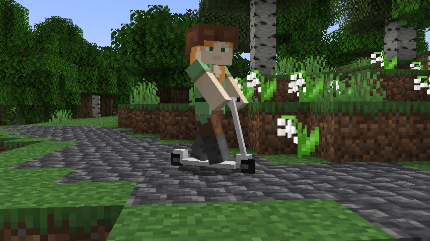
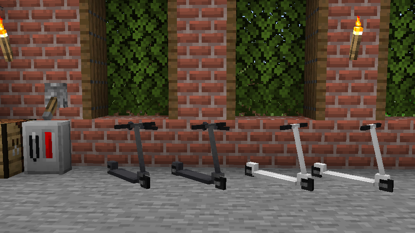
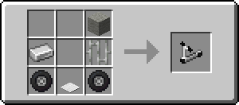
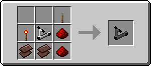
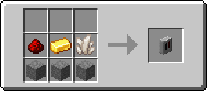
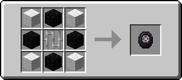
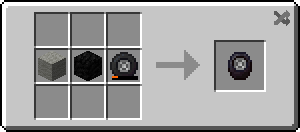
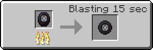
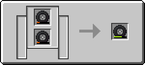

# Scooters Mod

A mod that adds kick scooters and electric scooters to Minecraft.

This mod is required on **both** the server and the client.

To get going quickly, see the [Quick Start Guide][1]. For more information, see the [User's Manual][2].

## Overview

Handle bar uses a wool block, any color. The charging station only works with electric scooters, which themselves need Netherite Scrap to make.

But to ride a scooter, you need tires! Tires use wool and coal blocks in their construction.

Additionally, you can customize your scooter! You can change the color of the shaft and of the back wheel cover using dye.

<!-- TODO: revisit screenshots -->

## Requirements

 - Quilt Loader
 - Fabric API or compatible

## Links

 - [GitHub](https://github.com/hibiii/Scooters)
 - [Quick Start Guide][1]
 - [User's Manual][2]

## License

This mod is available under the Unlicense license.
Feel free to learn from it and incorporate it in your own projects.

[1]: https://hibiscus.pet/mods/scooters/quick_start
[2]: https://hibiscus.pet/mods/scooters/manual